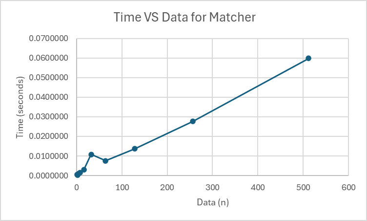

# Programming Assignment 1 – Matching and Verifying

## Course
COP 4533 – Algorithm Abstraction and Design 

University of Florida

## Authors
- Hung Hong (UFID: 56253262)
- Thyssen Nicholas (UFID: 19705329)

Part A - Hong
Part B - Nicholas

